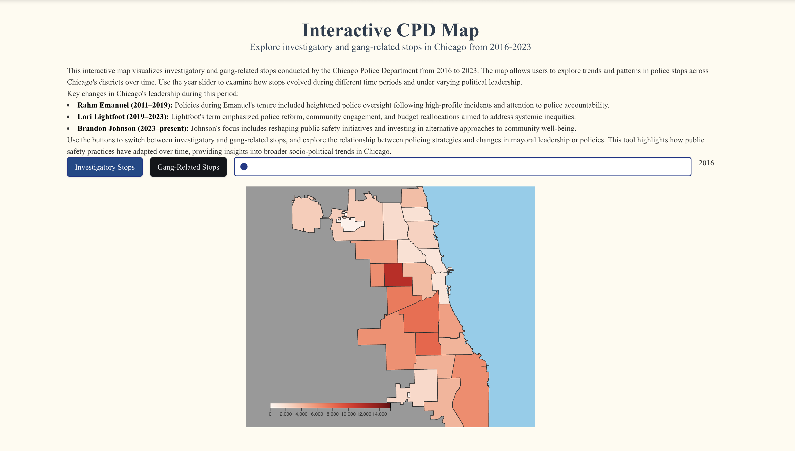

# Interactive CPD Stop Analysis Map

### **Amber Avila**

## Description
This interactive map visualizes investigatory and gang-related stops conducted by the Chicago Police Department (CPD) from 2016 to 2023. The tool allows users to explore trends and patterns in police stops across Chicago's districts over time. This offers insights into broader socio-political and policing strategies.

### Key Features:
- **Interactive Map**: Displays stops across Chicago's police districts.  
- **Year Slider**: Examine data year by year, from 2016 to 2023.  
- **Hover Feature**: View the number of stops in each district by hovering over it.  
- **Toggle Buttons**: Switch between investigatory stops and gang-related stops.  

This project offers a dynamic way to analyze the evolution of public safety practices and their relationship with political leadership and policy changes.

---

## Screenshot

---

## Data Sources
- **Chicago Police Department (CPD)**  
The data for investigatory and gang-related stops was sourced from the Chicago Police Department's official ISR data repository:  
[Chicago Police Department ISR Data](https://www.chicagopolice.org/statistics-data/isr-data/)  

### Data Usage and License:
The data is publicly available on the CPD website and used in compliance with their open data usage policies. It has been processed and visualized for educational and analytical purposes.
